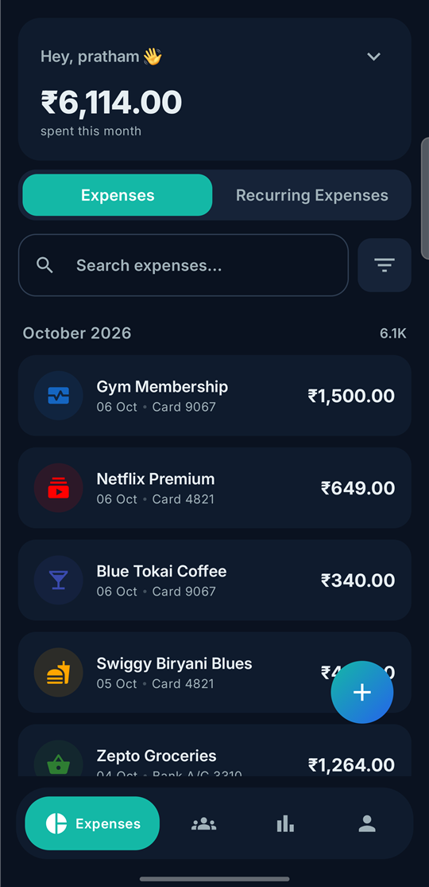
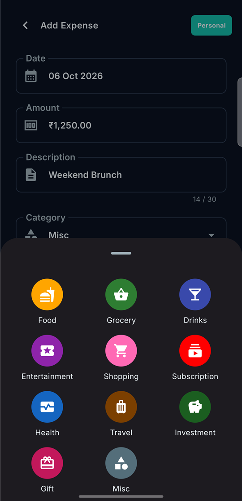
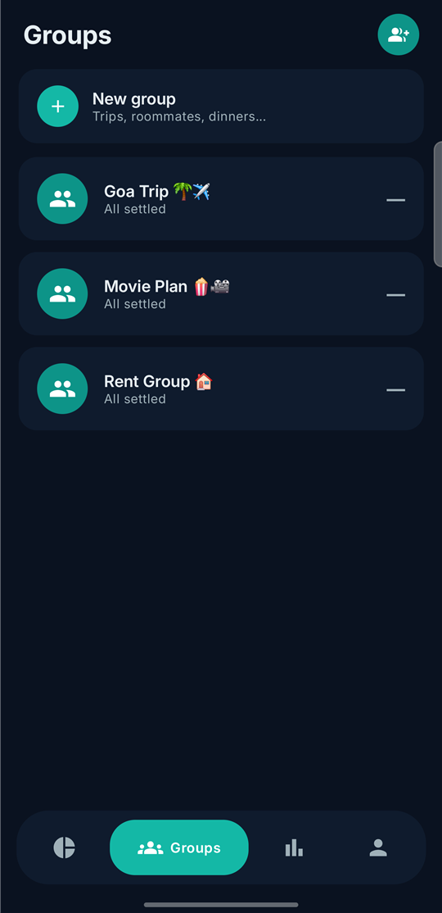
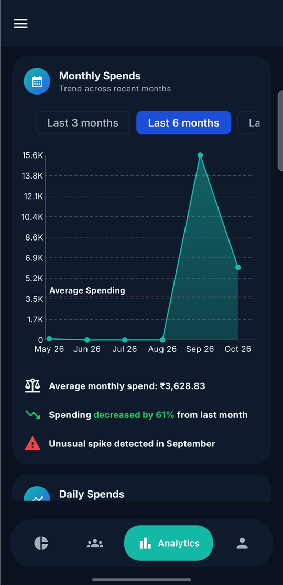
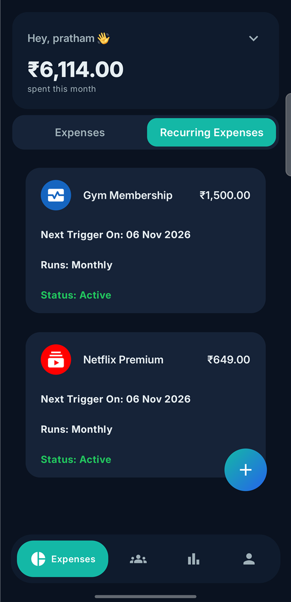
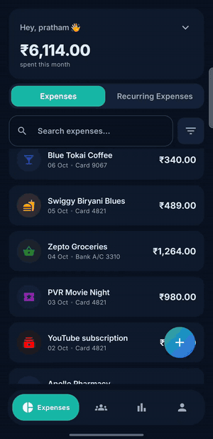
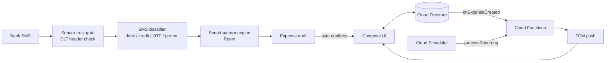

<div align="center">


# Settle

**Track your spending. Split with friends. Settle up in a tap.**

An Android app for personal expense tracking and group bill-splitting — with expenses
that add themselves from your bank SMS.


[**Join the beta**](#-try-the-beta) · [Demo](#-demo) · [Features](#-features) · [Tech stack](#-tech-stack) · [Architecture](#-architecture)

</div>

---

## 📱 Screenshots

<p align="center">
  
  
  
  
  
</p>

## 🎬 Demo

<p align="center">
  
</p>

<!-- Full-length video: paste the GitHub upload link for settle_demo.mp4 on the line below -->

## 🧪 Try the beta

Settle is in **closed testing on Google Play**, so it isn't publicly listed yet. To get it:

1. **Join the tester group** → [Settle Beta Testers](https://groups.google.com/g/settle-beta-testers) (use the Google account signed in on your phone)
2. **Opt in to testing** → [play.google.com/apps/testing/com.settle.tracker](https://play.google.com/apps/testing/com.settle.tracker)
3. **Install** from the Play Store link on that page. Updates arrive automatically like any other app.

> It can take a few minutes after joining the group before the opt-in page recognises you.
> Feedback is welcome, either through **Account → Report an issue** in the app or via [GitHub Issues](https://github.com/JoKeR-VIKING/Settle/issues).

## ✨ Features

### 👥 Group expenses & splitting
- Create groups for trips, flatmates or dinners, and invite people with a **shareable join link** (`settle://join`) or from your contacts
- Split **equally** or by **custom amounts**, with support for **multiple payers** on a single expense
- **Debt simplification** — net balances are reduced to the fewest possible payments
- **Settle up via UPI** — opens your UPI app pre-filled with the amount owed, or send a friendly payment reminder
- **Push notifications** whenever you're added to a new expense

### 📩 Expenses that add themselves (SMS)
- Bank and card transaction SMS become **expense drafts automatically** — review, tweak, save
- **Anti-phishing sender check** — only messages from DLT-registered bank sender IDs are trusted; look-alike messages from phone numbers are ignored
- A deterministic classifier filters out **OTPs, promos, card-bill reminders, upcoming EMI/SIP notices, refunds and credits**, so only real debits become expenses
- **Auto-detects the category and payment source** (card, account, wallet)
- Raw SMS text is **never stored or uploaded**; it's parsed on-device and discarded

### 🧠 Learns your routine
- A **spend-pattern engine** learns recurring everyday spends (e.g. a daily auto ride paid to a different UPI handle each time) from *your own corrections*, using amount and time of day
- Patterns start in **review mode** (pre-filled, tap to save) and graduate to **automatic** only after enough confirmations. Any edit teaches it what not to match

### 📊 Analytics
- **Personal, per-group and combined** views
- Breakdowns by **category, day, month, payment method, vendor and member**, plus top spenders

### 🔁 Everyday convenience
- **Recurring expenses** (daily, weekly or monthly), created on schedule by a cloud function
- **Search and filter** by category and amount range
- 12 categories: food, grocery, drinks, entertainment, shopping, subscription, health, travel, investment, gift, misc and settlement

### 🔒 Privacy & polish
- **Biometric app lock**
- **Light and dark themes**, motion, haptics, skeleton loading and first-run guided tours
- **In-app issue reporting** with redacted, privacy-safe diagnostics, plus Crashlytics crash tracking
- **Update prompts**, including forced updates for breaking releases

## 🛠 Tech stack

| Layer | Tools |
|---|---|
| **UI** | Kotlin, Jetpack Compose, Material 3, Navigation Compose, Coil, custom Canvas charts |
| **Local data** | Room (SMS drafts, learned spend patterns), SharedPreferences |
| **Auth** | Firebase Auth with Google Sign-In (Credential Manager), phone verification |
| **Backend** | Cloud Firestore, Firebase Cloud Messaging |
| **Server logic** | Firebase Cloud Functions (TypeScript): expense notifications, scheduled recurring expenses |
| **Quality** | Crashlytics, Play Integrity, JUnit tests for the SMS parser, pattern engine and diagnostics |
| **Delivery** | `dev` / `prod` product flavors, Firebase App Distribution, Google Play closed testing |

## 🏗 Architecture



```
app/src/main/java/com/settle/tracker/
├── screens/        # Top-level Compose screens (Expenses, Groups, Analytics, Account …)
├── components/     # Reusable UI: expenses, groups, analytics, charts, common
├── sms/            # SMS receiver, sender trust, classifier, parser, pattern engine
├── db/             # Room entities & DAOs
├── scheme/         # Firestore data models
├── utils/          # Split maths, app lock, theming, notifications, update checks
└── ui/             # Theme, typography, animations
functions/src/      # Cloud Functions (TypeScript)
```

## 🚀 Building locally

Requirements: Android Studio (latest stable), JDK 17, and your own Firebase project.

1. Create a Firebase project with an Android app for `com.settle.tracker` (and `com.settle.tracker.dev` for the dev flavor), then enable **Google sign-in**, **Phone auth**, **Firestore** and **Cloud Messaging**.
2. Download `google-services.json` into `app/` (it's gitignored).
3. Build the `devDebug` variant:
   ```bash
   ./gradlew assembleDevDebug
   ```
4. *(Optional)* Deploy the Cloud Functions:
   ```bash
   cd functions && npm install && firebase deploy --only functions
   ```

Run the unit tests with `./gradlew testDevDebugUnitTest`.

## 🙏 Acknowledgements

The SMS classifier and sender-trust gate are ported from
[abhirajsinha/omoi-sms-parser](https://github.com/abhirajsinha/omoi-sms-parser) (MIT).
See [THIRD_PARTY_NOTICES.md](THIRD_PARTY_NOTICES.md).

---

<div align="center">
Built by <a href="https://github.com/JoKeR-VIKING">Pratham Vasani</a>
</div>
